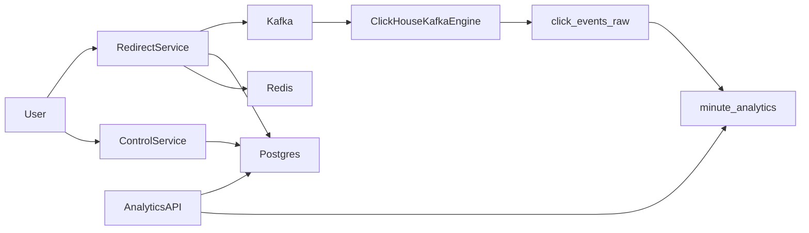

## Warp Backend Implementation Tickets

Below is a structured set of **developer-ready tickets** for the Warp backend, assuming:

- Tech stack from the spec: Spring MVC, Postgres, Redis, Kafka, ClickHouse, Docker.
- Basic redirect endpoint is already implemented in the data plane.

Treat each bullet as a separate ticket unless noted otherwise.

---

### 1. Project & Infrastructure Baseline

1. **Project scaffolding & configs hardening**
  - Verify `pom.xml`/`build.gradle` dependencies for Spring Web, Spring Data JPA, Postgres driver, Redis client, Kafka client, and any JSON libs.  
  - Configure application profiles (e.g., `application-local.yml`, `application-prod.yml`) with placeholders for DB, Redis, Kafka, ClickHouse.  
  - Ensure logging pattern and log levels are sane for prod vs local (request ID, short URL, status code).  
  - **Done when**: app boots locally, health endpoint returns 200, and configs compile with no missing properties.
2. **Docker & docker-compose for local stack**
  - Create `Dockerfile` for the Spring service.  
  - Create `docker-compose.yml` with services: Postgres, Redis, Kafka (+ Zookeeper or KRaft), ClickHouse, and the app container.  
  - Add volume mounts and basic init scripts for Postgres (schema) and ClickHouse (DDL).  
  - **Done when**: `docker compose up` brings up the full stack and the app can connect to all dependencies.

---

### 2. Postgres Schema & Persistence Layer

1. **Define `urls` JPA entity and repository**
  - Map the `urls` table as per section 4.A (`id`, `short_url`, `original_url`, `user_id`, `created_at`, `expires_at`, `deleted_at`, `is_protected`, `password`, `disabled`).  
  - Add unique index on `short_url` and supporting index on `(user_id, created_at)` via JPA annotations or migration scripts.  
  - Implement `UrlRepository` with methods: `findByShortUrlAndDeletedAtIsNull`, `findByUserId` (paged), etc.  
  - **Done when**: schema can be generated/migrated and basic repository tests pass.
2. **Database migrations setup**
  - Introduce Flyway or Liquibase migrations under `resources/db/migration`.  
  - Create baseline migration that creates `urls` with all columns and indexes.  
  - Wire migrations to run automatically on startup for local/dev profiles.  
  - **Done when**: clean database + app startup results in correct schema with no manual SQL steps.

---

### 3. Control Plane – Core URL Management API

1. **Create short URL (auto-generated) endpoint**
  - Implement `POST /api/urls` to create a short URL with auto-generated `short_url`.  
  - Define request DTO: `originalUrl`, optional `expiresAt`, `isProtected`, `password`, `disabled`.  
  - Implement `UrlService.createShortUrl()` to: validate input, generate unique short code, persist to Postgres, and return the new resource.  
  - Ensure collisions are handled with retries up to N attempts before failing.  
  - **Done when**: endpoint returns a 201 with full URL payload and DB row is created.
2. **Custom short URL endpoint & validation**
  - Extend `POST /api/urls` or add `POST /api/urls/custom` to support client-provided `shortUrl`.  
  - Enforce global uniqueness of `short_url` across all users; return 409 on conflict.  
  - Add validation rules: length limits, character set, reserved words blacklist.  
  - **Done when**: custom codes are accepted and stored, collisions are rejected with clear error messages.
3. **List & paginate user URLs**
  - Implement `GET /api/urls` scoped to current `user_id` with pagination parameters (page, size, sort).  
  - Support basic filters: active vs expired, protected vs not. 
  - Return minimal data for dashboard list: `shortUrl`, `originalUrl`, `createdAt`, `expiresAt`, `isProtected`, `disabled`.  
  - **Done when**: a user can fetch multiple pages of their URLs with stable ordering and not fetch soft deleted URLs.
4. **Soft delete URL endpoint**
  - Implement `DELETE /api/urls/{id}` that sets `deleted_at` instead of hard-delete.  
  - Enforce ownership (user can delete only their URLs).  
  - Ensure redirect and analytics ignore soft-deleted URLs.  
  - **Done when**: deleted URLs no longer redirect, no analytics are generated for them, but they remain in DB.
5. **URL detail read endpoint (for management UI)**
  - Implement `GET /api/urls/{id}` returning full config: destination, expiry, protection, disabled flag.  
  - Verify it does not expose sensitive fields (e.g., hashed password only, or with redaction rules).  
  - **Done when**: UI can fetch a single URL for management and edit forms.

---

### 4. Data Plane – Redirect Hardening & Password Protection

1. **Redirect behavior alignment with spec**
  - Ensure redirect endpoint checks, in order: existence, `deleted_at` null, `disabled` flag, expiry logic (`410` if expired), and password requirement.  
    - Always respond with `302` on valid, non-expired, not-disabled URLs.  
    - Return clear error codes/body for invalid/expired/disabled/deleted URLs.  
    - **Done when**: redirect path matches all functional requirements in section 1.1.
2. **Password-protected redirect flow**
  - Design a simple contract for password verification (e.g., `POST /r/{shortUrl}/verify` or query/body on redirect).  
    - Store passwords hashed (e.g., bcrypt/argon2) in `urls.password`.  
    - Implement a verify step that sets a short-lived token/cookie/session marker that allows the redirect without re-sending the password for a brief period.  
    - Ensure incorrect passwords result in 401/403 and do not reveal whether URL exists.  
    - **Done when**: protected URLs cannot be accessed without correct password, and correct password leads to normal redirect.
3. **Redis caching for redirects**
  - Introduce a cache abstraction that fetches URL data by `short_url` from Redis, falling back to Postgres if cache miss.  
    - Cache key structure: e.g., `url:{shortUrl}`, with relevant fields serialized.  
    - Implement TTL and cache invalidation strategy (on soft delete, disable, expiry changes).  
    - **Done when**: majority of redirects hit Redis only; Postgres fallback works and respects failure modes table.
4. **Local in-memory (Caffeine) + circuit breaker**
  - Add Caffeine cache in front of Redis for L1 hot keys as per failure modes section.  
    - Add circuit breaker logic so that when Redis is down, the system short-circuits to Postgres (with backoff) instead of hammering Redis.  
    - **Done when**: when Redis is misbehaving, redirects still work (degraded latency), and logs show circuit breaker state changes.

---

### 5. Short Code Generation & Collision Handling

1. **Short code generator utility**
  - Implement a dedicated component for code generation (e.g., base62 encoding, random or counter-based).  
    - Make length configurable; support future extension to counter-based generation for lower collision risk.  
    - Add unit tests to validate distribution and character set.  
    - **Done when**: generator is reusable and decoupled from HTTP layer.
2. **Collision retry logic & observability**
  - Implement collision detection: if generated `short_url` already exists, retry up to N times.  
    - Emit metrics/logs on collision count and failures.  
    - **Done when**: collisions are handled transparently for users up to threshold; beyond that, a clean 500/503 is returned with no partial writes.

---

### 6. Kafka Telemetry Producer (Redirect Service)

1. **Define `LinkVisited` event schema**
  - Specify a clear JSON/Avro schema that includes: `eventId`, `timestampUtc`, `urlId`, `shortUrl`, `httpStatus`, `countryCode`, `deviceType`, `referrer`, `responseLatencyMs`, `userId` (if available), and raw headers/UA as needed.  
    - Document schema versioning strategy.  
    - **Done when**: schema is versioned and documented in code and/or README.
2. **Implement non-blocking Kafka producer**
  - Configure Kafka producer (topic name, partitions, acks, retries).  
    - Integrate producer into the redirect path as **fire-and-forget** (do not block redirect on Kafka).  
    - Add error handling: log failures, use internal metrics, but never impact redirect response.  
    - **Done when**: every redirect attempt results in an attempted `LinkVisited` publish, and failures are observable but non-fatal.
3. **Enrich event with geo/referrer/device data**
  - Parse user agent into device category (mobile/desktop/tablet) and browser family.  
    - Extract referrer domain from `Referer` header.  
    - Integrate a simple IP-to-country mapping (stubbed or via library) for local dev.  
    - **Done when**: events in Kafka contain fields required for ClickHouse `click_events_raw` table.

---

### 7. ClickHouse OLAP Setup

1. **ClickHouse DDL for `click_events_raw`**
  - Write DDL for `click_events_raw` matching the design (timestamp UTC, event_id, url_id, short_url, status, country_code, device_type, referrer, latency, etc.).  
    - Configure Kafka Engine table to consume from the telemetry topic.  
    - Set retention/TTL policy for raw events (e.g., 7–30 days).  
    - **Done when**: events from Kafka appear in `click_events_raw` and can be queried.
2. **Rollup & materialized view for 1-minute analytics**
  - Create a materialized view that aggregates from `click_events_raw` into `minute_analytics` with 1-minute granularity.  
    - Fields per design: `minute`, `url_id`, `user_id`, `country`, `browser`, `clicks`, plus status buckets or latency buckets if desired.  
    - Ensure idempotency using `event_id` to avoid double-counting on replays.  
    - **Done when**: queries over `minute_analytics` return expected aggregates for test data.
3. **Time-window query helpers (analytics semantics)**
  - Implement reusable SQL snippets or views for common windows (1h, 4h, 1d, 3d, 7d, 30d) as per section 10.  
    - Validate “sliding window” semantics against the 1-minute rollup.  
    - **Done when**: queries for each supported time window are defined, tested, and documented.

---

### 8. Analytics API (Dashboard & Detail Views)

1. **Dashboard summary API – per URL**
  - Implement `GET /api/analytics/urls` returning, for each URL of a user: total clicks (all time), clicks in last 7 days, and basic metadata (`shortUrl`, `originalUrl`).  
    - Optimize via ClickHouse queries hitting `minute_analytics` and not `click_events_raw`.  
    - **Done when**: dashboard can render a list of URLs with summary stats without per-URL queries.
2. **URL detail analytics API with filters**
  - Implement `GET /api/analytics/urls/{urlId}` with query params: time window (1h/4h/1d/3d/7d/30d), filters for country, referrer, device type, HTTP status, and latency buckets.  
    - Return data structured for charts/tables (e.g., time series + breakdowns).  
    - **Done when**: a single endpoint powers the detailed analytics view with all required filters.
3. **Pagination & large-result handling for analytics**
  - For potentially large analytics responses (e.g., many countries or referrers), support pagination or top-N + “others” grouping.  
    - Document limits and sorting behavior.  
    - **Done when**: analytics endpoints remain performant and predictable even for heavy users.

---

### 9. Periodic Reconciliation & Integrity

1. **Reconciliation job for daily drift detection**
  - Implement a scheduled job (e.g., Spring `@Scheduled`) that runs daily, recomputing aggregates from `click_events_raw` for “yesterday” and comparing to `minute_analytics`.  
    - Produce a drift report (missing keys, deltas > threshold) into logs and/or a dedicated table.  
    - **Done when**: running the job on test data surfaces intentional discrepancies.
2. **Optional repair pipeline for closed windows**
  - Implement a safe repair mechanism that writes corrected aggregates into a new table/partition, then swaps or merges into `minute_analytics` for closed days only.  
    - Guard against mutating current-day or in-flight minutes.  
    - **Done when**: operator can trigger a repair and see corrected aggregates with audit trail.

---

### 10. Observability & SLO Validation

1. **Metrics & tracing for redirect and control plane**
  - Add metrics: redirect latency (p50/p95/p99), error rates by status, cache hit rate, Kafka publish failures, DB/Redis latency.  
    - Integrate with a metrics backend (Prometheus-style exposition even if only used in local/Grafana).  
    - Optionally add distributed tracing spans for redirect, DB, Redis, Kafka interactions.  
    - **Done when**: key SLOs from section 7 can be derived from metrics.
2. **Health checks & readiness probes**
  - Implement `/actuator/health` (or equivalent) health indicators for Postgres, Redis, Kafka (optional), and ClickHouse (optional).  
    - Distinguish readiness (can serve traffic) vs liveness (process alive).  
    - **Done when**: container orchestrator could safely restart or de-route instances based on health.
3. **Load testing scripts and baseline SLO check**
  - Set up k6/Locust scripts to simulate redirect RPS (targeting 50k RPS) with realistic key distributions.  
    - Run tests against the Docker stack and collect latency + error metrics.  
    - Compare measured p99 latency and error rates to SLOs; document results and bottlenecks.  
    - **Done when**: you have at least one test report showing current performance vs design goals.

---

### 11. Hardening & Edge Cases

1. **Validation and security hardening**
  - Implement strict URL validation (no unsupported schemes, prevent obvious SSRF where applicable).  
    - Add rate limiting or simple abuse protections where necessary (even if basic, e.g., per-IP limits on create).  
    - Ensure sensitive fields (password hashes, internal IDs) are never leaked in logs or APIs.  
    - **Done when**: common abuse vectors are mitigated to a reasonable degree for this project.
2. **Failure-mode simulations**
  - Explicitly simulate each scenario from the Failure Modes table (Redis down, Postgres down, Kafka down, ClickHouse down, duplicate events, short URL collision, thundering herd).  
    - Verify the app behavior matches the documented consequences (e.g., redirects still work when Kafka down, p99 may increase when Redis down).  
    - **Done when**: a short document or README section summarizes actual behavior vs expected for each failure mode.

---

### 12. Documentation

1. **Developer/runbook documentation**
  - Document how to run the system locally (Docker commands, env variables, migrations).  
    - Document how to add new analytics dimensions or modify the schema safely.  
    - Add a short architecture overview referencing control/data/analytics planes and key flows.  
    - **Done when**: a new developer could bootstrap the system and understand major components in under an hour.

---

### High-Level Architecture Diagram

These tickets are intentionally ordered so you can pull them one by one. You can also group by theme (e.g., finish all Control Plane tickets before deep-diving into Analytics Plane).