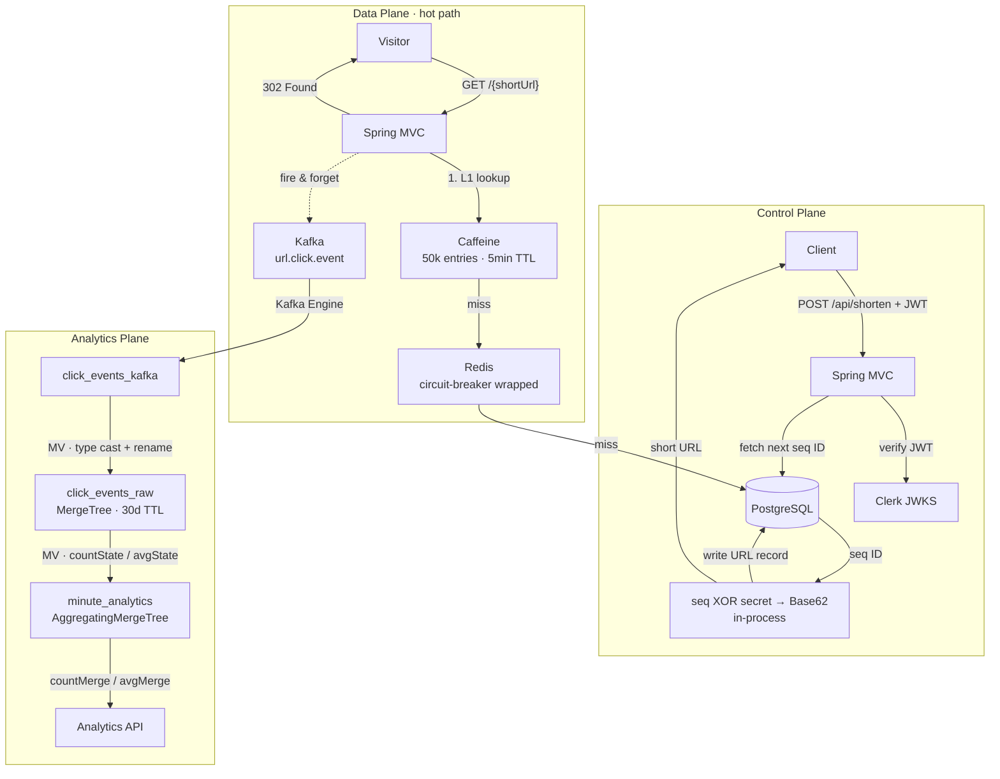

# Warp

A high-throughput URL shortener built to handle millions of daily redirects, with a real-time analytics pipeline.

---

## Architecture

Three separated planes — control (management), data (hot-path redirects), and analytics (OLAP) — so that each can scale and fail independently.



**Observability:** Micrometer → Prometheus → Grafana. Cache hit rates (L1/L2), Kafka publish failures, and redirect latency are instrumented as named counters/timers.

---

## Key Engineering Decisions

### Two-tier cache to minimise Postgres load

A redirect that hits Postgres on every request cannot sustain millions of DAU. Redis alone introduces a network round-trip (~1ms) on every hit. The solution is a two-level cache:

- **L1 — Caffeine** (in-process): 50,000 entries, 5-minute TTL per status. No network, no serialisation. Serves the majority of hot URLs at nanosecond cost.
- **L2 — Redis** (shared): 1-hour TTL for active URLs, shorter for `NOT_FOUND` and `EXPIRED` entries. Populated on L1 miss; result is promoted back to L1.

Each cache tier uses status-aware TTLs — a `NOT_FOUND` entry caches for 60 s (reduces DB fan-out from invalid codes), `EXPIRED` for 5 min, `ACTIVE` for min(remaining-lifetime, 1h) so URLs don't serve stale data past their expiry window.

### Circuit breaker on Redis

Redis unavailability must not take down redirects. `CacheUtil` wraps all Redis operations (`get`, `set`, `delete`) with a Resilience4j circuit breaker (`redisCache`). Lettuce is configured with `REJECT_COMMANDS` on disconnect so failures are immediate rather than hanging; this lets the circuit breaker trip fast. When open, the service falls through to Postgres — redirects degrade gracefully, latency rises but availability holds.

### Kafka for analytics decoupling

Writing click telemetry synchronously would add 5–20ms to every redirect and couple redirect availability to analytics availability. Instead, the redirect handler builds a `UrlClickEvent` and calls `KafkaTemplate.send()` non-blocking — the `CompletableFuture` callback logs ACK/failure but the HTTP response is already sent. If Kafka is down, click events are lost for that window (logged as warnings), but redirects are unaffected. ClickHouse's long Kafka retention means the pipeline catches up automatically on recovery.

### ClickHouse OLAP pipeline — no Spring consumer

Running a Spring Kafka consumer to insert into ClickHouse would add operational complexity and a potential lag bottleneck. Instead, ClickHouse's native Kafka Engine table (`click_events_kafka`) acts as the consumer. Two materialized views do the rest:

1. `click_events_consumer` MV — transforms camelCase JSON from Kafka (Float64 Unix timestamp) into the typed `click_events_raw` MergeTree table (DateTime64 UTC, snake_case columns).
2. `minute_analytics_mv` MV — aggregates each incoming batch into 1-minute rollups using `countState()` / `avgState()`, feeding the `AggregatingMergeTree` table `minute_analytics`.

Dashboard queries read `minute_analytics` using `countMerge()` / `avgMerge()` — they scan pre-aggregated rows, not raw events. `LowCardinality(String)` on `country_code`, `device_type`, and `browser` cuts storage and speeds up GROUP BY on these columns.

### Short URL generation

Three decisions compose the final design:

**Counter — Postgres sequence, not Redis.** A distributed counter needs to be atomic and durable. Redis `INCR` is fast but adds a new failure mode to the control plane: if Redis is unavailable, URL creation fails. A Postgres sequence is already present, natively atomic, crash-safe, and requires no extra infrastructure. Since URL creation is not on the hot redirect path, the marginal latency of a sequence fetch is irrelevant.

**Encoding — Base62 for compact codes.** The sequence value is Base62-encoded (`0-9A-Za-z`). With 7 characters, Base62 gives 62⁷ ≈ 3.5 trillion unique codes — enough headroom to never worry about exhaustion. 7 characters was chosen as the minimum length that comfortably covers that range while staying short in a URL.

**Obfuscation — XOR with a secret to prevent enumeration.** Encoding a raw sequence produces sequential codes (`000001`, `000002`, …) that are trivially enumerable — an attacker can walk every short URL ever created. Before encoding, the sequence value is XOR-ed with a secret long (`SHORT_URL_SECRET`). This scrambles the bit pattern so codes appear random to anyone who doesn't know the secret, while remaining fully deterministic and collision-free. No lookup table, no extra storage, no coordination.

### Geo-resolution with Cloudflare fallback

Country codes are resolved with a two-step strategy: check the `CF-IPCountry` header first (Cloudflare sets this at the edge with zero latency overhead), then fall back to in-process MaxMind GeoIP2 (`DatabaseReader` loaded once at startup). Private/loopback IPs are skipped cleanly without hitting the database.

---

## Tech Stack

| Layer | Technology |
|---|---|
| Framework | Spring MVC (Spring Boot 3) |
| Auth | Clerk (JWKS JWT validation) |
| Primary DB | PostgreSQL + Flyway migrations |
| Cache L1 | Caffeine |
| Cache L2 | Redis (Lettuce) |
| Circuit Breaker | Resilience4j |
| Message Broker | Apache Kafka |
| Analytics DB | ClickHouse 24.3 |
| Geo-resolution | MaxMind GeoIP2 (classpath MMDB) |
| Observability | Micrometer + Prometheus + Grafana |
| Containerisation | Docker + Docker Compose |

---

## Running Locally

**Prerequisites:** Docker, Java 21, Maven. A Supabase Postgres instance and Clerk dev environment (set in `application-local.properties`).

```bash
# Start Redis, Kafka, ClickHouse, Prometheus, Grafana
docker compose up -d

# Run the app against the local profile
./mvnw spring-boot:run -Dspring-boot.run.profiles=local
```

| Service | URL |
|---|---|
| API | http://localhost:8080 |
| Swagger UI | http://localhost:8080/swagger-ui.html |
| Grafana | http://localhost:3000 (admin / admin) |
| Prometheus | http://localhost:9090 |
| ClickHouse HTTP | http://localhost:8123 |

**Required env / properties** (via `application-local.properties` or env vars):

| Variable | Purpose |
|---|---|
| `SPRING_DATASOURCE_URL` | PostgreSQL JDBC URL |
| `SPRING_DATASOURCE_USERNAME` / `_PASSWORD` | DB credentials |
| `CLERK_JWKS_URI` | Clerk JWKS endpoint |
| `SHORT_URL_SECRET` | Long integer XOR secret |
| `APPLICATION_DOMAIN_URL` | Base URL for returned short links |

Flyway runs migrations on startup. Dev seed data is applied when the `local` profile is active.

---

## Performance Engineering

### Load Test Results

All tests ran against Supabase free-tier Postgres (Jakarta → Seoul) with an 80/20 split of valid vs. non-existent URLs, except scenario 5–6 which use a fully-warm cache.

| # | Config | Condition | RPS | Median | p95 | OK Rate |
|---|---|---|---|---|---|---|
| 1 | No CB, No L1 | Redis down, 20% miss | 28.7 | 1.91 s | 5 s | 59% |
| 2 | CB, No L1 | Redis down, 20% miss | 96 | 933 ms | 1.34 s | 99.5% |
| 3 | CB + L1 | Redis down, 20% miss | 445 | 1.88 ms | 1 s | 100% |
| 4 | CB + L1 | Redis up, 20% miss | 500 | 1.71 ms | 941 ms | 100% |
| 5 | CB + L1 | Redis down, no miss | 7,000 | 10 ms | 20 ms | 100% |
| 6 | CB + L1 | Redis up, no miss | 7,500 | 10 ms | 18 ms | 100% |

The 15× gap between scenario 3 and 5/6 isolates the cost of the remote database — eliminating Postgres from the hot path is the single biggest throughput lever. The near-identical 5 vs. 6 numbers show that once L1 has a 100% hit rate, Redis state is irrelevant.

### Lesson 1 — Redis Connection Pool (Lettuce default is a single shared connection)

**Symptoms at ~200 concurrent users:** Redis throughput dropped, latency spiked to ~40 ms (should be <1 ms on localhost), CPU fell from 0.6 → 0.3, and DB queries appeared despite a warm cache.

**Root cause:** Lettuce's connection pool is disabled by default. All threads share one TCP connection, serialising every command. At 200+ threads the queue time dominated latency, and connection-layer timeouts were misinterpreted as cache misses, triggering Postgres fallbacks.

**Diagnosis path:**
```
CPU drops under load → threads waiting, not working
  → only I/O in hot path is Redis
    → Redis itself is fast (<1 ms)
      → bottleneck is between app and Redis
        → no pool configured; single shared connection
```

**Fix — enable Lettuce pool:**
```properties
spring.data.redis.lettuce.pool.enabled=true
spring.data.redis.lettuce.pool.max-active=150
spring.data.redis.lettuce.pool.max-idle=50
spring.data.redis.lettuce.pool.min-idle=20
spring.data.redis.lettuce.pool.max-wait=2000ms
```

Result: 2.5× throughput (4K → 10K ops/s), CPU 0.3 → 0.9, DB fallback queries gone.

Key tradeoffs: each connection costs ~10 KB on the Redis side; `max-wait=-1` (the default) lets requests hang forever if Redis stalls; `min-idle=0` means cold-start traffic pays connection-creation cost.

### Lesson 2 — Circuit Breaker Prevents Cascading Failure

Without a circuit breaker and with Redis down, the system collapsed to **20 RPS / 5 s p95**. Every request hit Redis twice (check + write-back), each call hanging until TCP timeout. Threads piled up, exhausted HikariCP's 10-connection pool, and the backlog compounded.

**What worked:** Resilience4j circuit breaker. After a handful of failures the circuit opens and requests skip Redis entirely with zero overhead. The system degrades to ~50% throughput (Postgres fallback) instead of collapsing:

Lettuce is configured with `REJECT_COMMANDS` on disconnect so failures surface immediately (no hang), which lets the breaker trip on the first wave rather than waiting for full timeout expiry.

---

## What's Next

**Rate limiting** — the redirect endpoint has no per-IP or per-user throttle. The natural place is a token-bucket filter at the servlet layer, backed by Redis for distributed state, with a Lua script for atomic decrement to avoid race conditions.

**Multi-region** — the current architecture is single-region. The data plane (redirects) is the obvious candidate for edge deployment: replicate the PostgreSQL read replica and Redis to each region, route `GET /{shortUrl}` to the nearest region via GeoDNS or a global load balancer. The control plane (writes) can stay centralised. The analytics pipeline would need per-region Kafka topics with ClickHouse consuming from all of them, or a global Kafka cluster.
